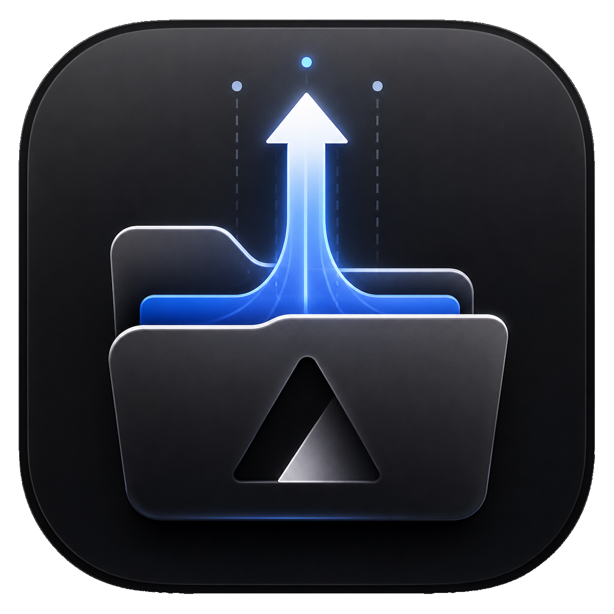

<div align="center">



# Dropcel

**Drop a project into a folder. Seconds later, it's live.**

[](https://github.com/jagenaujagenau/dropcel/releases/latest)
[](https://github.com/jagenaujagenau/dropcel/actions/workflows/ci.yml)
[](./LICENSE)
[](https://github.com/jagenaujagenau/dropcel/releases/latest)

</div>

## The job

You have a web project on your machine. You want it live, on a URL, now —
without git, CI, a terminal, or a dashboard.

Dropcel turns a folder into that URL:

1. **Drop** a project into `~/Vercel` — or onto the window, menu bar, or dock.
2. **It deploys** to production. Automatically, on every save.
3. **Share** — the URL is already in your clipboard.

If it's in the folder, it's live.

## Quick Start

```bash
brew tap jagenaujagenau/tap
brew install --cask dropcel
```

Or download from [Releases](https://github.com/jagenaujagenau/dropcel/releases).
Sign in once with your Vercel account — if you've ever run `vercel login`,
Dropcel finds it. Then drop a folder.

## What you never think about

- Frameworks — Next.js, Astro, Vite, Svelte, plain HTML… detected automatically
- Redundant deploys — identical content never deploys twice
- Broken states — mid-rebase trees, offline edits, and save-storms are held, not shipped
- The failure wall — errors read like "package.json is missing", never "something went wrong"

History, logs, and domains live one right-click away in Vercel's dashboard.

## Project Structure

```
dropcel/
├── src/               # TypeScript app layer (React UI, deploy queue, Vercel API)
│   ├── components/    # UI components
│   ├── core/          # detection, state machine, queue, auth, REST client
│   └── pages/         # dashboard, onboarding, settings
├── src-tauri/         # Rust native layer (watcher, SQLite, tray, keychain)
├── public/icons/      # framework logos + generated folder icon sets
└── .github/           # CI + release workflows
```

## Development

```bash
pnpm install
pnpm tauri dev     # run the app
pnpm test          # TypeScript tests
cargo test         # Rust tests (from src-tauri/)
```

Design notes in [ARCHITECTURE.md](./ARCHITECTURE.md). Issues and PRs welcome.

## License

[MIT](./LICENSE) © Diego Peralta
