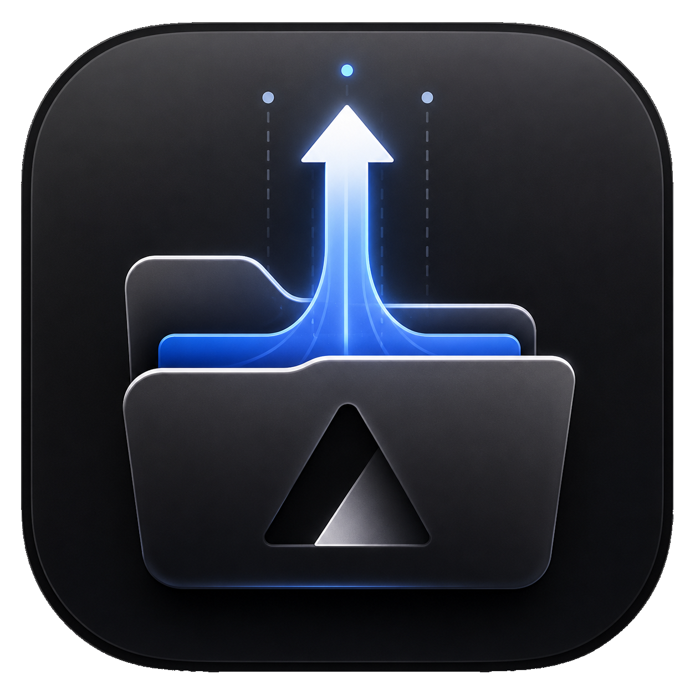

<div align="center">



# Dropcel

**Your folder is the deployment. Save a file — the site is already updated.**

[](https://github.com/jagenaujagenau/dropcel/releases/latest)
[](https://github.com/jagenaujagenau/dropcel/actions/workflows/ci.yml)
[](./LICENSE)
[](https://github.com/jagenaujagenau/dropcel/releases/latest)

</div>

## The job

Getting a site live for the *first* time is a solved problem. `vercel deploy`
is one command; [Vercel Drop](https://vercel.com/docs/drop) is one drag.

The friction is every time after that. Each change means going back and doing
the thing again — re-running the command, re-dragging the folder, re-invoking
the agent. The deploy step never goes away; it just gets repeated.

Dropcel removes the step instead of speeding it up. Point it at `~/Vercel`.
Every folder inside is a production site, and it *stays* current:

1. **Drop** a project into `~/Vercel` — or onto the window, menu bar, or dock.
2. **Then never deploy again.** Every save ships to the same project,
   automatically, with no command and no click.
3. **Share** — the URL is already in your clipboard.

There is no deploy button, because there is no deploy step. If it's in the
folder, it's live — and it keeps being live.

## How it compares

Worth being direct about, since the alternatives are good:

| | First deploy | Every deploy after | Runs when you're not looking |
|---|---|---|---|
| **Vercel CLI** | `vercel deploy` | re-run the command | no |
| **Vercel Drop** | drag into the browser | drag again | no |
| **Git integration** | connect a repo | commit + push | on push |
| **Dropcel** | drop a folder | **just save the file** | **yes — menu bar, always on** |

Use git integration if you want review, branches, previews per PR, and an audit
trail — it is the right tool for a team, and Dropcel does not replace it.
Reach for Dropcel when the ceremony costs more than the change is worth:
a landing page, a demo, a prototype, something a tool generated for you, or
anything you'd rather edit than deploy.

## Quick Start

```bash
brew tap jagenaujagenau/tap
brew install --cask dropcel
```

Or download from [Releases](https://github.com/jagenaujagenau/dropcel/releases).
Sign in once with your Vercel account — if you've ever run `vercel login`,
Dropcel finds it. Then drop a folder.

## What you never think about

A loop that runs unattended has to be trustworthy in ways a one-shot upload
doesn't. Most of the work here is in what it declines to do:

- **Broken states** — a mid-rebase tree, a half-saved burst, an offline edit:
  held, not shipped, then deployed once when things settle
- **Leaking secrets** — git's staging step is what normally stops a private
  key escaping. There isn't one here, so `.env*`, `*.pem`/`*.key`, `.npmrc`,
  `.ssh/` and friends are never uploaded — and the build log names anything
  it withheld, so nothing disappears silently
- **Redundant deploys** — identical content never deploys twice, which is
  also what keeps a watch loop inside Vercel's rate limits
- **Rate limits** — when Vercel says wait, it waits exactly that long
- **Frameworks** — Next.js, Astro, Vite, Svelte, plain HTML… detected for you
- **The failure wall** — errors read like "package.json is missing", never
  "something went wrong"

History, logs, and domains live one right-click away in Vercel's dashboard.

Press <kbd>⌘K</kbd> for any of it without the mouse — filter projects, copy a
URL, redeploy, open the last failed build log.

## Project Structure

```
dropcel/
├── src/               # TypeScript app layer (React UI, deploy queue, Vercel API)
│   ├── components/    # UI components
│   ├── core/          # detection, state machine, queue, auth, REST client
│   └── pages/         # dashboard, onboarding, settings
├── src-tauri/         # Rust native layer (watcher, SQLite, tray, keychain)
├── assets/icons/      # framework logos + generated folder icon sets
└── .github/           # CI + release workflows
```

## Development

```bash
pnpm install
pnpm tauri dev     # run the app
pnpm test          # TypeScript tests
cargo test         # Rust tests (from src-tauri/)
```

Design notes in [ARCHITECTURE.md](./ARCHITECTURE.md). Issues and PRs welcome.

## License

[MIT](./LICENSE) © Diego Peralta
